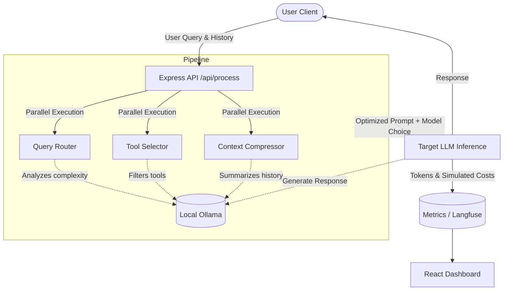

# LLM Token Optimizer

Middleware designed to intelligently optimize AI token usage. This system acts as a proxy between your user queries and Large Language Models, applying a suite of real-time optimizations to reduce prompt sizes, lower latency, and dramatically cut down (simulated or real) API costs, all while relying on local, privacy-preserving Ollama models.

## 🚀 How it Works

The LLM Token Optimizer runs a 3-step parallel **Optimization Pipeline** before executing the actual target LLM inference. All these optimization steps leverage a fast, local LLM to minimize latency overhead:

1. **Query Routing**: Analyzes the complexity of the user query. Simple questions (e.g., greetings, basic math) are routed to a fast, cheap model (e.g., `qwen2.5:1.5b`), while complex analytical tasks are sent to an expensive/powerful model (e.g., `mistral`).
2. **Tool Selection**: Instead of passing all available application tools in the system prompt, this module analyzes the query and strictly filters the tool list down to only the tools necessary to answer the current request, saving hundreds of context tokens.
3. **Context Compression**: When conversation histories get too long, this module summarizes or drops older, less relevant messages, ensuring the context window remains small and efficient.

Once the optimizations are complete, the constructed, hyper-efficient prompt is sent to the selected model, and the token savings/costs are tracked via local metrics and Langfuse telemetry.

## 🏗️ Architecture Diagram



## 📂 Project Structure

This project is divided into a Node/Express backend and a React frontend:

- **`/backend`**: The core token optimization engine.
  - `src/optimizations/`: Contains the pipeline modules (`queryRouter.js`, `toolSelector.js`, `contextCompressor.js`).
  - `src/ollamaClient.js`: Local LLM integration handler.
  - `src/optimizationPipeline.js`: Orchestrates the parallel execution of the optimization steps.
  - `src/metricsStore.js` & `src/langfuseClient.js`: Telemetry and token usage tracking.
  - `src/server.js`: The Express API endpoints.
- **`/frontend`**: A React dashboard to interact with the optimizer and visualize savings.
  - `src/components/ChatPanel.js`: Chat interface with optimization toggles.
  - `src/components/MetricsPanel.js`: Live metrics on token savings and simulated costs.
  - `src/components/AnalyticsPanel.js`: Deep dive into token waterfall charts and system performance.

## ⚙️ Setup Instructions

### 1. Prerequisites
- [Node.js](https://nodejs.org/) installed.
- [Ollama](https://ollama.com/) installed and running locally.
- Pull the required Ollama models:
  ```bash
  ollama run mistral
  ollama run qwen2.5:1.5b
  ```

### 2. Environment Variables
You need to set up environment files in **both** the `frontend` and `backend` (and optionally the root directory):
- Navigate to the `frontend` directory, copy `.env.example` to `.env`.
- Navigate to the `backend` directory, copy `.env.example` to `.env`.
- **Note on API Keys**: Add your Langfuse or Gemini keys if you are using those integrations. If you want to use the maintainer's Langfuse keys, please request them, as they are not public in this repository. 

### 3. Running the App

**Start the Backend:**
```bash
cd backend
npm install
npm start
```
*The backend will run on `http://localhost:3001`.*

**Start the Frontend:**
```bash
cd frontend
npm install
npm start
```
*The frontend will run on `http://localhost:3000`.*
